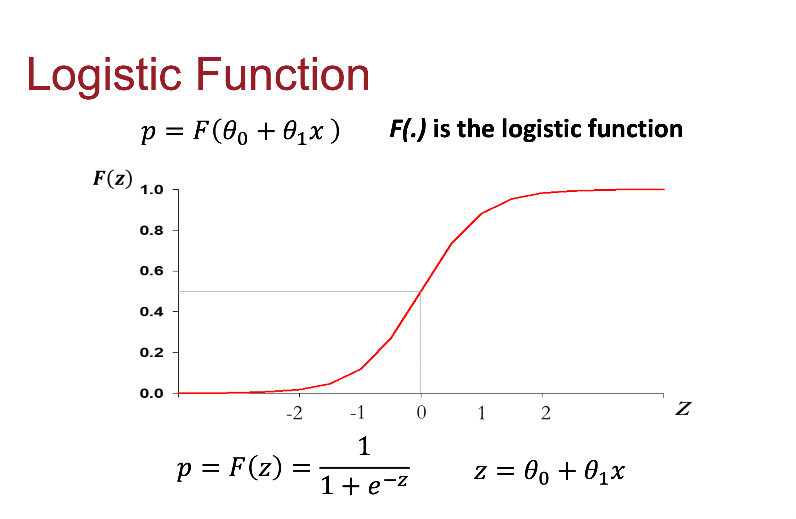

<!--
 * @Author: 27
 * @LastEditors: 27
 * @Date: 2024-04-19 22:58:58
 * @LastEditTime: 2024-04-19 23:24:06
 * @FilePath: /Yume-MBA-homework/yume_doc/logic_doc.md
 * @description: type some description
-->
# 逻辑回归的材料补充
## 算法原理
logic func:

z 的公式为:
z = $\phi$ + $\phi_1$ x$_1$ + $\phi_2$x$_2$ + $\phi_3$x$_3$ + .......
各个 x 为 各个 feature

## 整体流程图

## 代码截图

### 代码运行评分截图

